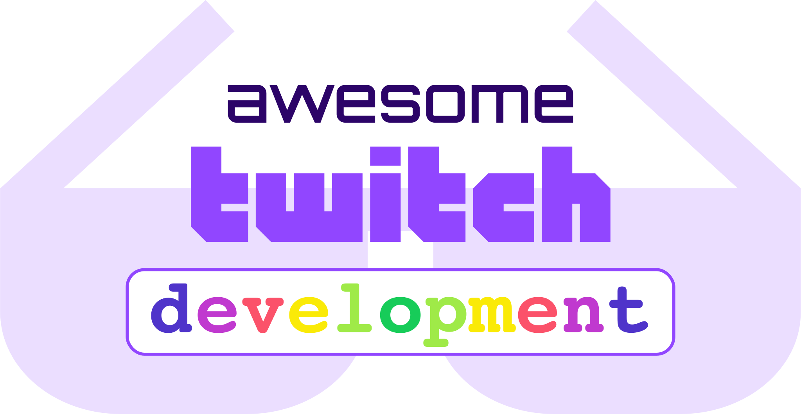

	

	 
	
	 
	

    <a href="https://www.twitch.tv/">Twitch</a> is the home of shared live experiences. 
    <a href="https://dev.twitch.tv/">Developers</a> impact how streamers and viewers experience games, 
    pop culture, and conversations at scale.
	

> A curated list of resources for Twitch Developers.

## Contents
- [Official](#official)
- [Getting help](#getting-help)
- [Documentation](#documentation)
- [Toolchain](#toolchain)
- [Libraries](#libraries) 
  - [Angelscript](#angelscript)
  - [C](#c)
  - [C++](#c-1)
  - [C#](#c-2)
  - [GDscript](#gdscript)
  - [Golang](#golang)
  - [Haskel](#haskel)
  - [Java](#java)
  - [JavaScript (Node.js)](#javascript-nodejs)
  - [JavaScript (Browser Extensions)](#javascript-browser-extensions)
  - [JavaScript (Twitch Extensions)](#javascript-twitch-extensions)
  - [PHP](#php)
  - [Python](#python)
  - [Rust](#rust)
  - [Swift](#swift)
  - [Visual Basic .NET](#visual-basic-net)
- [Extension Starter Kits](#extension-starter-kits)
- [Guides and Tutorials](#guides-and-tutorials)
- [Related lists](#related-lists)

## Official
- [Website](https://dev.twitch.tv) - Official website.
- [Showcase](https://dev.twitch.tv/showcase) - Showcase of community projects.
- [Blog](https://blog.twitch.tv/en/tags/developers) - Developer blog.
- [GitHub](https://github.com/twitchdev) - Official Twitch repos on GitHub.
- [Twitter](https://twitter.com/TwitchDev) - Twitch Twitter account.
- [Jobs](https://www.twitch.tv/jobs/) - Twitch is hiring Software Engineers.
- [Twitch channel](https://www.twitch.tv/twitchdev) - TwitchDev twitch channel.

## Getting help
- [Forum](https://discuss.dev.twitch.tv) - Announcements, FAQ, RFCs, Events and more.
- [TwitchDev Discord Server](https://link.twitch.tv/devchat) - Chat with other Twitch developers.
- [Twitch Libraries Discord Server](https://discord.gg/8NXaEyV) - Discover Server with channels organized by programming language.
- [Stack Overflow](https://stackoverflow.com/questions/tagged/twitch) - Stack Overflow is a question and answer site for professional and enthusiast programmers. 
- [Bug reports](https://github.com/twitchdev/issues/issues) - Third party developer product bug reports.
- [Feature Requests](https://twitch.uservoice.com/forums/310213-developers) - Upvote developer experience improvement ideas.
- [IGDB Discord Server](https://discord.gg/JKsh9R7) - Discord Server for Internet Game Database.
- [Meetups](https://meetups.twitch.tv/) - Virtual Meetups directory.
- [Contact Support](https://help.twitch.tv/s/contactsupport) - File Twitch Support tickets for general bugs.

## Documentation
- [Developer Docs](https://dev.twitch.tv/docs) - Twitch Developer Documentation.
- [Developer Agreement](https://www.twitch.tv/p/en/legal/developer-agreement/) - Twitch Developer Services Agreement.

## Toolchain
- [Twitch Console](https://dev.twitch.tv/console) - Manage extensions, applications, drops and organizations.
- [Extension Developer Rig](https://dev.twitch.tv/docs/extensions/rig) - The Developer Rig allows Extensions developers to develop and test Extensions quickly, easily, and locally.
- [Twitch CLI](https://github.com/twitchdev/twitch-cli) - The official Twitch CLI to make developing on Twitch easier.
- [API Status](https://devstatus.twitch.tv) - Availability and latency metrics for the Twitch API and Developer Products, as well as incidents that affect them.

## Libraries

### Angelscript
- [23rd/TwitchPotPlayer](https://github.com/23rd/TwitchPotPlayer) - Extensions for PotPlayer to watch Twitch streams without streamlinks or any crap.

### C
- [notr1ch/TwitchTest](https://github.com/notr1ch/TwitchTest) - Bandwidth tester for Twitch.

### C++
- [Chatterino/chatterino2](https://github.com/Chatterino/chatterino2) - Chatterino 2 is a chat client for Twitch.tv.
- [alamminsalo/orion](https://github.com/alamminsalo/orion) - Cross platform Twitch.tv client

### C#
- [TwitchLib/TwitchLib](https://github.com/TwitchLib/TwitchLib) - C# Twitch Chat, Whisper, API and PubSub Library. Allows for chatting, whispering, stream event subscription and channel/account modification.
- [jdpurcell/RechatTool](https://github.com/jdpurcell/RechatTool) - Downloads the chat log from a Twitch VOD.
- [SaviorXTanren/mixer-mixitup](https://github.com/SaviorXTanren/mixer-mixitup) - Streaming bot application for handling chat, events, moderation, and other streamer assistance features.
- [Grahnz/TwitchIRC-Unity](https://github.com/Grahnz/TwitchIRC-Unity) - Lightweight IRC client component for use with the Unity Engine.
- [DevChatter/DevChatterBot](https://github.com/DevChatter/DevChatterBot) - Twitch chat bot.
- [VolvoxCommunity/Volvox.Helios](https://github.com/VolvoxCommunity/Volvox.Helios) - Powerful, modular, web-managed, open-source Discord bot created by a community for communities.
- [SaviorXTanren/StreamingClientLibrary](https://github.com/SaviorXTanren/StreamingClientLibrary) - Client library for Twitch, YouTube Live, and other streaming services.
- [lexonegit/Unity-Twitch-Chat](https://github.com/lexonegit/Unity-Twitch-Chat) - Lightweight and easy-to-use Twitch IRC client for Unity projects.
- [michidk/TwitchCSharp](https://github.com/michidk/TwitchCSharp) - Twitch C# Wrapper for the Twitch v3 REST API.
- [pendo324/EssentialNowPlaying](https://github.com/pendo324/EssentialNowPlaying) - A now playing tool intended to be used with OBS.

### GDScript
- [drtwisted/godot-twicil](https://github.com/drtwisted/godot-twicil) - Godot Twitch Chat Interaction Layer.

### Golang
- [Twitch CLI](https://github.com/twitchdev/twitch-cli) - The official Twitch CLI to make developing on Twitch easier.
- [gempir/go-twitch-irc](https://github.com/gempir/go-twitch-irc) - Go IRC client for twitch.tv.
- [nicklaw5/helix](https://github.com/nicklaw5/helix) - A Twitch Helix API client written in Go.
- [tracy-and-matt/go-twitch-pubsub](https://github.com/tracy-and-matt/go-twitch-pubsub) - Go library for Twitch PubSub.

### Haskel
- [tsoding/HyperNerd](https://github.com/tsoding/HyperNerd) - Total Surveillance Automatic Ban Machine for Twitch and Discord.

### Java
- [twitch4j/twitch4j](https://github.com/twitch4j/twitch4j) - Modular Async/Sync/Reactive Twitch API Client / IRC Client.
- [chatty/chatty](https://github.com/chatty/chatty) - Chatty is a Twitch Chat Client for Desktop written in Java.
- [TwitchRecover/TwitchRecover](https://github.com/TwitchRecover/TwitchRecover) - Twitch VOD tool which recovers all VODs including those that are sub only or deleted.
- [GlitchCog/ChatGameFontificator](https://github.com/GlitchCog/ChatGameFontificator) - Twitch chat display that uses the fonts of various video games.
- [SebastianRask/Pocket-Plays-for-Twitch](https://github.com/SebastianRask/Pocket-Plays-for-Twitch) - Open source Twitch client for Android.
- [Gikkman/Java-Twirk](https://github.com/Gikkman/Java-Twirk) - Small, basic library for communication via the Twitch chat. Java 8 compatible.

### JavaScript (Node.js)
- [tmijs/tmi.js](https://github.com/tmijs/tmi.js) - Connect to and interact with Twitch chat (IRC) from Node.js or a browser.
- [osslate/irc-message](https://github.com/osslate/irc-message) - Performant, streaming IRC message parser.
- [twurple/twurple](https://github.com/twurple/twurple) - Interact with Twitch's API, chat, PubSub and subscribe to WebHooks.
- [twitch-js/twitch-js](https://github.com/twitch-js/twitch-js) - A community-centric, community-supported version of tmi.js
- [sogehige/sogeBot](https://github.com/sogehige/sogeBot) - Free Twitch Bot built on Node.js.
- [clarkio/vscode-twitch-highlighter](https://github.com/clarkio/vscode-twitch-highlighter) - VS Code extension that will allow your Twitch chat to highlight a line of code via a command message.
- [streamwall/streamwall](https://github.com/streamwall/streamwall) - Display a mosaic of livestreams. Built for streaming.
- [skarab42/marv](https://github.com/skarab42/marv) - Marv your Swiss streaming tool.
- [kritzware/twitch-bot](https://github.com/kritzware/twitch-bot) - Easily create chat bots for Twitch.tv.
- [crowbartools/Firebot](https://github.com/crowbartools/Firebot) - Powerful all-in-one bot for Twitch streamers.
- [dongy7/twitch-chat-cli](https://github.com/dongy7/twitch-chat-cli) - Twitch chat in your terminal.
- [freaktechnik/twitch-chatlog](https://github.com/freaktechnik/twitch-chatlog) - Fetch the chatlog to a twitch VOD from your command line.
- [robotty/dank-twitch-irc](https://github.com/robotty/dank-twitch-irc) - Connect to Twitch chat from Node.js.
- [clarkio/ttv-chat-bot](https://github.com/clarkio/ttv-chat-bot) - Twitch TV chat reader to control colors for overlays from Stream Elements and/or internet connected light bulbs.
- [bdougie/git-twitc](https://github.com/bdougie/git-twitch) - Service for GitHub and twitch interaction.
- [twitch-desktop/twitch-desktop](https://github.com/twitch-desktop/twitch-desktop) - Twitch Desktop Client for Windows, OSX and Linux.
- [fgl27/smarttv-twitch](https://github.com/fgl27/smarttv-twitch) - Twitch client for Samsung Smart TVs 2015 and newer models.
- [nikitakatchik/smarttv-twitch](https://github.com/nikitakatchik/smarttv-twitch) - Twitch app for Samsung Smart TV.
- [Supinic/supibot](https://github.com/Supinic/supibot) - Multiplatform, utility & novelty chat bot.
- [pendo324/universal-np](https://github.com/pendo324/universal-np) - A now playing tool intended to be used with things like OBS.
- [ryancharris/react-livestream](https://github.com/ryancharris/react-livestream) - Embed your Twitch, Mixer or YouTube stream in your website automatically when you're live.

### JavaScript (Browser Extension)
- [trmcnvn/twitch-channel-points](https://github.com/trmcnvn/twitch-channel-points) - Auto-click those bonus channel points on Twitch.

### JavaScript (Twitch Extensions)

### PHP
- [nicklaw5/twitch-api-php](https://github.com/nicklaw5/twitch-api-php) - Twitch API client for PHP.
- [romanzipp/Laravel-Twitch](https://github.com/romanzipp/Laravel-Twitch) - Twitch Helix API PHP Wrapper for Laravel

### Python
- [PetterKraabol/Twitch-Chat-Downloader](https://github.com/PetterKraabol/Twitch-Chat-Downloader) - Download chat messages from past broadcasts on Twitch.
- [TwitchIO/TwitchIO](https://github.com/TwitchIO/TwitchIO) - Async Bot/API wrapper for Twitch made in Python.
- [ihabunek/twitch-dl](https://github.com/ihabunek/twitch-dl) - CLI tool for downloading videos from Twitch.
- [pajbot/pajbot](https://github.com/pajbot/pajbot) - Twitch moderation bot.
- [KiranGershenfeld/VisualizingTwitchCommunities](https://github.com/KiranGershenfeld/VisualizingTwitchCommunities) - Graphing communities on Twitch.tv in a visually intuitive way.
- [xenova/chat-downloader](https://github.com/xenova/chat-downloader) - Simple tool used to retrieve chat messages from livestreams, videos, clips and past broadcasts.
- [PetterKraabol/Twitch-Python](https://github.com/PetterKraabol/Twitch-Python) - Object-oriented Twitch API for Python developers.
- [tsifrer/python-twitch-client](https://github.com/tsifrer/python-twitch-client) - Python wrapper for Twitch API.
- [ContentAutomation/TwitchCompilationCreator](https://github.com/ContentAutomation/TwitchCompilationCreator) - Fully automated system that transforms Twitch clips into gaming compilations.
- [offish/twitchtube](https://github.com/offish/twitchtube) - Automatically make video compilations of the most viewed Twitch clips and upload them to YouTube using Python.
- [andrei-zgirvaci/Twitch-Farmer](https://github.com/andrei-zgirvaci/Twitch-Farmer) - Bot that helps you to get more followers on Twitch.
- [gottagofaster236/Twitch-Channel-Points-Miner](https://github.com/gottagofaster236/Twitch-Channel-Points-Miner) - Simple script that will watch a stream for you and get the channel points.
- [BasioMeusPuga/twitchy](https://github.com/BasioMeusPuga/twitchy) - CLI streamlink wrapper for twitch.tv.
- [harkbound/PythonTwitchBotFramework](https://github.com/sharkbound/PythonTwitchBotFramework) - Asynchronous twitchbot framework made in pure Python.
- [ancalentari/twitch-stream-recorder](https://github.com/ancalentari/twitch-stream-recorder) - Record twitch streams live!
- [Teekeks/pyTwitchAPI](https://github.com/Teekeks/pyTwitchAPI) - A Python 3.7 implementation of the Twitch API and its Webhook.
- [streamcord/streamcord](https://github.com/streamcord/streamcord) - A Discord bot that interacts with the popular streaming service Twitch.tv
- [Bare7a/Streamlabs-Chatbot-Scripts](https://github.com/Bare7a/Streamlabs-Chatbot-Scripts) - A collection of Scripts for Streamlabs Chatbot.

### Rust
- [udoprog/OxidizeBot](https://github.com/udoprog/OxidizeBot) - High performance Twitch bot in Rust.
- [museun/twitchchat](https://github.com/museun/twitchchat) - Interface to the irc portion of Twitch's chat.

### Swift
- [Chris-Perkins/SwiftTwitch](https://github.com/Chris-Perkins/SwiftTwitch) - Twitch API for iOS. Wrapped in Swift goodness.

### Visual Basic .NET
- [MarcoPNS/Spotify-Stream-Widget](https://github.com/MarcoPNS/Spotify-Stream-Widget) - Stream Widget for Spotify is a small Tool for Streamers to show the current Track of Spotify to your Viewers.

## Extension Starter Kits
- [Breci/twitch-ext-vuex](https://github.com/Breci/twitch-ext-vuex) - An abstraction of the Twitch Extension helper for VueX.
- [tracy-and-matt/twitch-extension-vue-starter](https://github.com/tracy-and-matt/twitch-extension-vue-starter) - Twitch Extension Vue Starter Kit.

## Guides and Tutorials
- [Get started with Twitch Extensions](https://dev.twitch.tv/docs/extensions)
- [Twitch Authentication Guide](https://dev.twitch.tv/docs/authentication)

## Related lists
- [Awesome Twitch](https://github.com/RightToBearArmsLOL/awesome-twitch) - A curated list of awesome Twitch related websites & resources.
- [Awesome Developer Streams](https://github.com/bnb/awesome-developer-streams) - A curated list of awesome developers who stream.
- [Awesome Streaming Tools](https://github.com/juancarlospaco/awesome-streaming-tools) - Visually attractive eye candy and useful tools that you can show off on your stream.
- [Awesome Live Coding Streams](https://github.com/Caaddss/awesome-live-coding-streams) - List of awesome live coding streams (Portuguese).
- [GitHub #twitch](https://github.com/topics/twitch) - Popular GitHub tag for Twitch projects.
- [Community Coding Resources](https://dev.twitch.tv/code) - A directory which includes open source tools, tutorials, and libraries built or submitted by the Twitch Developer community.
- [GitHub #twitchdev](https://github.com/topics/twitchdev) - GitHub tag used by "Community Coding Resources" projects.